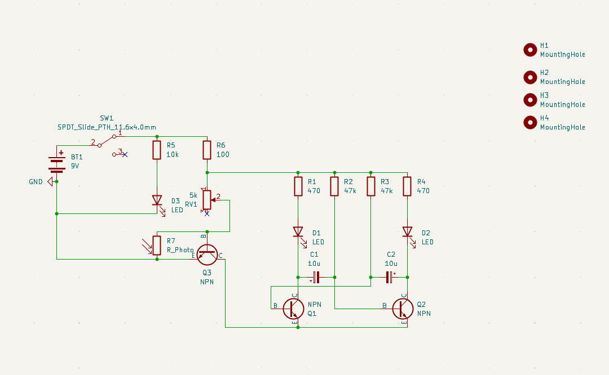
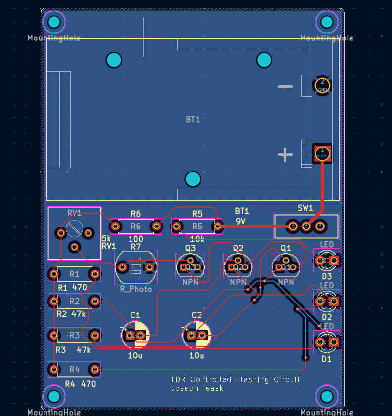
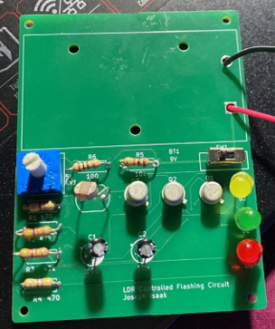
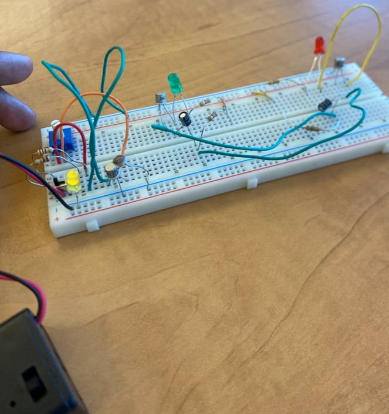

# LDR-Controlled Flashing Circuit

## Overview
This project is a light-dependent resistor (LDR) based flashing circuit designed in KiCAD, fabricated as a PCB, and tested under real-world lighting conditions.

## Objective
To design a circuit that responds to ambient light levels by triggering a flashing output when light intensity drops below a threshold.

## Design Process
- Schematic design in KiCAD
- PCB layout and routing
- Fabrication and soldering
- Functional testing under varying light conditions

## Key Features
- Light-sensitive triggering using LDR
- Light-sensitivity threshold adjustment through potentiometer
- Stable PCB-based implementation
- Fully soldered and tested hardware prototype

## Images
### Schematic

### PCB Layout

### Final Board

### Testing Setup

## Skills Demonstrated
- Analog circuit design
- KiCAD schematic + PCB layout
- PCB assembly and soldering
- Hardware debugging and testing

## Results
The circuit successfully responded to changes in ambient light and triggered flashing behavior when light levels decreased.
